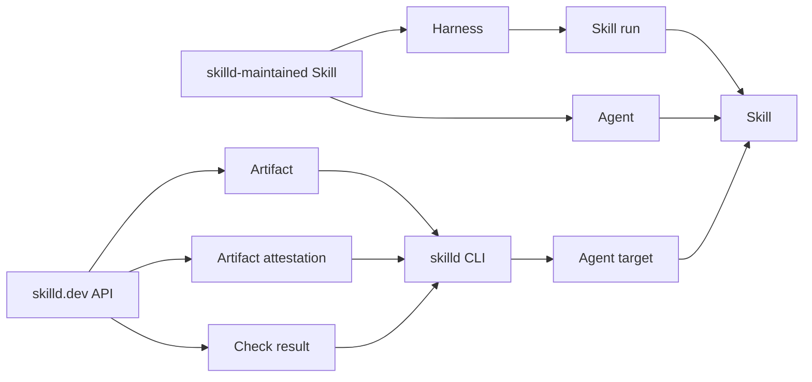

# Glossary

Canonical vocabulary for skilld v3.

Every public export, command, error, route, and document uses these terms.

## Map

| Term | Export or owner | Stability | Consumers | Customer word |
| --- | --- | --- | --- | --- |
| Skill | Agent Skills specification | external standard | Agent, skilld CLI, Harness | Skill |
| transient Skill | `skilld run` | published command | Agent, developer | transient Skill |
| skilld-maintained Skill | `skills/*` | published asset | Agent, Harness | skilld-maintained Skill |
| skilld CLI | `skilld` | published CLI | developer, CI | skilld CLI |
| Harness | `skilld-harness` | published package | application, CI | Harness |
| Skill run | `skilld-harness` | published type | Harness consumer | Skill run |
| Repository | GitHub | external standard | skilld.dev, skilld CLI | repository |
| Account | GitHub and skilld.dev | external standard | GitHub App, skilld.dev | account |
| Artifact | `skilld.dev/api/v1` | published protocol | skilld CLI | Artifact |
| Artifact attestation | `skilld.dev/api/v1` | published protocol | skilld CLI | attestation |
| Check result | `skilld.dev/api/v1` | published protocol | skilld CLI, developer | check result |
| Source status | lockfile and protocol | published value | skilld CLI, CI | source status |
| Update relation | skilld CLI JSON v1 | published value | Agent, developer, CI | update relation |
| Agent target | skilld CLI | published configuration | Agent | Agent target |

| Identifier | Term |
| --- | --- |
| `skilld search` | Skill search |
| `skilld run` | transient Skill load |
| `skilld install` | Skill install |
| `skilld list` | installed Skills |
| `skilld view` | Skill details |
| `skilld remove` | Skill removal |
| `skilld update` | Skill update |
| `skilld update --check --json` | update relation check |
| `skilld verify` | source verification |
| `skilld outdated` | outdated Skill report |
| `skilld outdated --all` | system-wide outdated Skill report |
| `skilld install skilld --global` | global skilld Skill install |
| `skilld auth login` | account login |
| `skilld auth status` | account authentication status |
| `skilld auth logout` | account logout |
| `skilld config get` | configuration read |
| `skilld config set` | configuration write |
| `skilld config list` | configuration list |

Collisions

`Skill run` and `transient Skill` sound alike and mean different things.
A Skill run is one Harness execution.
A transient Skill is one Skill that `skilld run` loads for a session.
The Rust type for the second is `TransientSkill`, never `SkillRun`.

## Terms

### Skill

**Is:** a directory that follows the Agent Skills specification.

**Use for:** authored instructions and their supporting files.

**Never:** prompt pack, guide, plugin.

**Casing:** `Skill` in product prose, `skill` in identifiers.

### skilld-maintained Skill

**Is:** a Skill maintained and published by the skilld project.

**Use for:** visible generation, review, search, and install instructions under `skills/*`.

**Never:** built-in prompt, hidden prompt, system prompt.

**Casing:** `skilld-maintained Skill` in prose.

### transient Skill

**Is:** a Skill that `skilld run` loads for the current Agent session.

**Use for:** any Skill used without an install.

**Never:** ephemeral skill, temporary install, one-off install, Skill run.

**Casing:** `transient Skill` in prose, `TransientSkill` in Rust.

### skilld CLI

**Is:** the Rust command line interface that searches, installs, updates, and removes Skills.

**Use for:** the command product and its manager logic.

**Never:** Skill manager in customer copy, generator, authoring engine, JavaScript CLI.

**Casing:** `skilld CLI` in prose, `skilld` for the executable.

### Harness

**Is:** the JavaScript package that runs skilld-maintained Skills with strict output checks.

**Use for:** `skilld-harness` and its public interface.

**Never:** CLI engine, generator CLI, manager runtime.

**Casing:** `Harness` in product prose, `harness` in identifiers.

### Skill run

**Is:** one Harness execution with one tagged input and one result.

**Use for:** `PackageSkill`, `ProjectSkill`, and `ReviewSkill` operations.

**Never:** job, task, session, workflow run.

**Casing:** `Skill run` in prose, `SkillRun` in TypeScript.

### Repository

**Is:** a GitHub repository that contains one or more Skills.

**Use for:** source identity and `OWNER/REPOSITORY` input.

**Never:** repo in customer copy, package host, registry entry.

**Casing:** `Repository` in headings, `repository` in sentences.

### Account

**Is:** the user account authenticated with skilld.dev and GitHub.

**Use for:** authentication and private repository access.

**Never:** tenant or user identity in customer copy.

**Casing:** `Account` in headings, `account` in sentences.

### Artifact

**Is:** immutable Skill bytes resolved from one exact source commit.

**Use for:** remote delivery from `skilld.dev` to the skilld CLI.

**Never:** hosted Skill, registry package, upload.

**Casing:** `Artifact` in protocol types, `artifact` elsewhere.

### Artifact attestation

**Is:** a signed claim that links one Artifact to its Repository, commit, contents, and check results.

**Use for:** provenance and integrity verification before installation.

**Never:** safety certificate, approval, endorsement.

**Casing:** `Artifact attestation` in headings, `attestation` in sentences and identifiers.

### Check result

**Is:** one named check, version, finding, and outcome for an Artifact.

**Use for:** exact evidence inside an Artifact attestation.

**Never:** safety certificate, secure badge, guarantee.

**Casing:** `Check result` in headings, `check result` in sentences.

### Source status

**Is:** the recorded provenance state for an installed Skill.

**Use for:** `verified`, `local`, or `unverified` lockfile values.

**Never:** safety state, trust score, verification tier.

**Casing:** `Source status` in headings, `sourceStatus` in identifiers.

### Update relation

**Is:** the Git relationship between an installed Skill commit and its current source commit.

**Use for:** `current`, `available`, `behind`, `diverged`, `pinned`, `notTracked`, or `unavailable` JSON values.

**Never:** upgrade status, version status, release status.

**Casing:** `Update relation` in headings, `relation` in JSON.

### Agent target

**Is:** an Agent installation destination managed by skilld.

**Use for:** Agent directory rules and copy or link mode.

**Never:** adapter, platform, destination type.

**Casing:** `Agent target` in prose, `AgentTarget` in types.

### Outdated Skill report

**Is:** the per Skill status produced by `skilld outdated`.

**Use for:** current, outdated, unverified, local, and unmanaged Skill states.

**Never:** version check, drift report, health check.

**Casing:** `Outdated Skill report` in prose, `outdated` in commands.

## Banned

| Never | Use instead | Why |
| --- | --- | --- |
| safe, secure | name the exact checks | An attestation cannot guarantee safety. |
| private registry | private Artifact delivery | GitHub remains the source of truth. |
| Skill manager | skilld CLI | Match GitHub CLI customer language. |
| repo | repository | Match GitHub documentation. |
| tenant | account | Match GitHub account language. |
| audit receipt | Artifact attestation and check result | Match GitHub supply chain language. |
| trust state | source status | State exactly what is verified. |
| Skill generator CLI | skilld-maintained Skill or Harness | The skilld CLI has no generation logic. |
| hidden prompt | skilld-maintained Skill asset | Judgment instructions stay visible. |

## Open questions

None.
