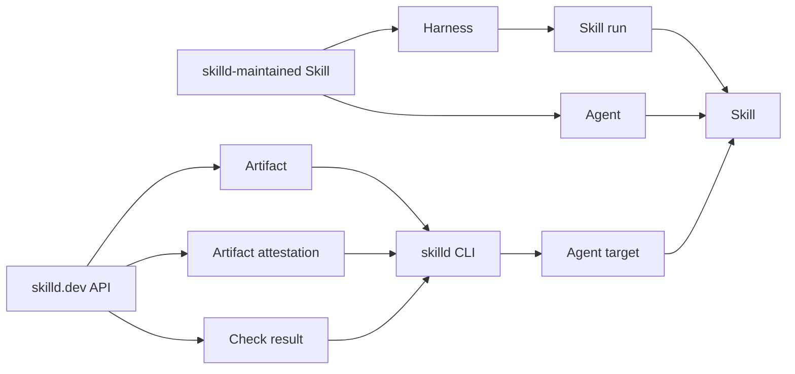

# Glossary

Canonical vocabulary for skilld v3.

Every public export, command, error, route, and document uses these terms.

## Map

| Term | Export or owner | Stability | Consumers | Customer word |
| --- | --- | --- | --- | --- |
| Skill | Agent Skills specification | external standard | Agent, skilld CLI, Harness | Skill |
| transient Skill | `skilld run` | published command | Agent, developer | transient Skill |
| fork | `skills/skilld` | Agent workflow | Agent, developer | fork |
| skilld-maintained Skill | `skills/*` | published asset | Agent, Harness | skilld-maintained Skill |
| skilld CLI | `skilld` | published CLI | developer, CI | skilld CLI |
| Harness | `skilld-harness` | published package | application, CI | Harness |
| Skill run | `skilld-harness` | published type | Harness consumer | Skill run |
| local sandbox | `skilld-harness/sandbox-local` | published export | Harness consumer, CI | local sandbox |
| Repository | GitHub | external standard | skilld.dev, skilld CLI | repository |
| Account | GitHub and skilld.dev | external standard | GitHub App, skilld.dev | account |
| Artifact | `skilld.dev/api/v1` | published protocol | skilld CLI | Artifact |
| Artifact attestation | `skilld.dev/api/v1` | published protocol | skilld CLI | attestation |
| Check result | `skilld.dev/api/v1` | published protocol | skilld CLI, developer | check result |
| Linked file | `skilld.dev/api/v1` | published protocol | skilld CLI | linked file |
| behavior | `packages/protocol/rules/skill-behaviors.json`, `skilld run` | published value | Agent, developer | behavior |
| behavior reading | `behavior-review` check result, `BEHAVIOR_CONFIRMATION_REQUIRED` | published value | Agent, developer | model reading |
| Source status | lockfile and protocol | published value | skilld CLI, CI | source status |
| Skill page | `skilld.dev` and skilld CLI output | published value | Agent, developer | Skill page |
| Update relation | skilld CLI JSON v1 | published value | Agent, developer, CI | update relation |
| Agent target | skilld CLI | published configuration | Agent | Agent target |
| registry | skilld.dev | published surface | developer, Agent | registry |
| curated | skilld.dev | published surface | developer | curated |
| author | GitHub | external standard | skilld.dev, developer | author |
| provenance | lockfile and protocol | published value | skilld CLI, developer | provenance |
| lockfile | `.skills/skilld-lock.yaml` | published file | skilld CLI, CI | lockfile |
| Curator | skilld.dev | published route | skilld.dev, skilld CLI | curator |
| Collection | skilld.dev | published route | skilld.dev, skilld CLI | collection |
| Multi-skill ref | `skilld run`, `skilld add` | published argument | developer, Agent | ref |
| CLI upgrade | skilld CLI | published behavior | developer | upgrade |
| release manifest | GitHub release | published file | skilld CLI, install script | release manifest |
| public API | `skilld.dev/api/v1`, `skilld-sdk/openapi.json` | published protocol | skilld CLI, developer | skilld API |
| track | skilld.dev and `skilld tracks` | published route | developer, Agent | track |
| trending | skilld.dev and `skilld trending` | published route | developer, Agent | trending |
| like | skilld.dev and `skilld like` | published value | account | like |
| watch | skilld.dev and `skilld watch` | published value | account | watch |
| digest | skilld.dev | published email | account | digest |
| index request | `skilld.dev/api/v1` and `skilld index` | published protocol | developer, Agent | index request |
| skilld token | skilld.dev and `skilld tokens` | published credential | account, CI | token |

| Identifier | Term |
| --- | --- |
| `skilld search` | Skill search |
| `skilld run` | transient Skill load |
| `skilld run --file` | supporting file read |
| `--allow` on `run`, `install`, `add`, `update` | behavior approval |
| `skilld install` | Skill install |
| `skilld add` | multi-skill install |
| `skilld run OWNER/REPOSITORY` | Skill index |
| `skilld list` | installed Skills |
| `skilld view` | Skill details |
| `skilld remove` | Skill removal |
| `skilld update` | Skill update |
| `skilld sync` | declared Skill sync |
| `skilld sync --check --json` | declared Skill check |
| `skilld update --check --json` | update relation check |
| `skilld verify` | source verification |
| `skilld outdated` | outdated Skill report |
| `skilld outdated --all` | system-wide outdated Skill report |
| `skilld doctor` | Skill discovery and cleanup |
| `skilld install skilld --global` | global skilld Skill install |
| `skilld auth login` | account login |
| `SKILLD_NO_WEEKLY` | weekly notice opt-out |
| `SKILLD_API_URL` | API origin override |
| `skilld auth status` | account authentication status |
| `skilld auth logout` | account logout |
| `skilld config get` | configuration read |
| `skilld config set` | configuration write |
| `skilld config list` | configuration list |
| `skilld view OWNER/REPOSITORY/SKILL` | registry Skill details |
| `skilld view OWNER/REPOSITORY` | registry Repository details |
| `skilld view @LOGIN` | curator details |
| `skilld view @LOGIN/SLUG` | collection details |
| `skilld browse` | registry browse |
| `skilld trending` | trending Skills |
| `skilld tracks` | track list |
| `skilld tracks SLUG` | track details |
| `skilld curators` | curator list |
| `skilld index` | index request |
| `skilld account` | account settings |
| `skilld account set` | account setting change |
| `skilld account scan` | Repository scan |
| `skilld account unpublish` | Repository unpublish |
| `skilld like` | Skill like |
| `skilld unlike` | like removal |
| `skilld likes` | liked Skills |
| `skilld likes @LOGIN` | a curator's liked Skills |
| `skilld watch` | watch |
| `skilld unwatch` | watch removal |
| `skilld watches` | watched Repositories |
| `skilld changes` | digest changes |
| `skilld stars` | starred Repositories |
| `skilld stars import` | star import |
| `skilld collection create` | collection creation |
| `skilld collection add` | collection Skill add |
| `skilld collection remove` | collection Skill removal |
| `skilld tokens` | skilld token list |
| `skilld tokens create` | skilld token creation |
| `skilld tokens revoke` | skilld token revocation |

```mermaid
flowchart LR
  OS[skilld-maintained Skill]
  A[Agent]
  H[Harness]
  R[Skill run]
  S[Skill]
  API[skilld.dev API]
  AR[Artifact]
  AT[Artifact attestation]
  CR[Check result]
  CLI[skilld CLI]
  T[Agent target]

  OS --> A
  OS --> H
  H --> R --> S
  A --> S
  API --> AR
  API --> AT
  API --> CR
  AR --> CLI
  AT --> CLI
  CR --> CLI
  CLI --> T
  T --> S
```

Collisions

`Skill run` and `transient Skill` sound alike and mean different things.
A Skill run is one Harness execution.
A transient Skill is one Skill that `skilld run` loads for a session.
The Rust type for the second is `TransientSkill`, never `SkillRun`.

`skilld index` and the Skill index of `skilld run OWNER/REPOSITORY` share a word.
`skilld index` sends an index request: it asks skilld.dev to add a Repository to the registry.
The Skill index is the list of Skills that `skilld run` prints for a ref.

`skilld add` and `skilld collection add` share a verb.
`skilld add` installs selected Skills from one ref.
If several Skills are listed, a normal terminal asks which to install.
An Agent, pipe, CI, or `--plain` requires `--all` to install every listed Skill.
Listing never requests registry indexing. Delivery failures never switch to direct installation.
`skilld collection add` puts one Skill in one of your collections and installs nothing.

The weekly and the digest are two emails.
The weekly reports liked Skills that changed, plus what trended.
The digest reports changes in watched Repositories.
`skilld account set weekly` and `skilld account set digest` switch them apart.

`stars` on a Skill counts GitHub stars of its Repository.
`skilld stars` lists the Repositories you starred on GitHub that hold Skills.

## Terms

### Skill

**Is:** a directory that follows the Agent Skills specification.

**Use for:** authored instructions and their supporting files.

**Never:** prompt pack, guide, plugin.

**Casing:** `Skill` in product prose, `skill` in identifiers.

### skilld-maintained Skill

**Is:** a Skill maintained and published by the skilld project.

**Use for:** visible generation, review, search, and install instructions under `skills/*`.

**Never:** built-in prompt, hidden prompt, system prompt.

**Casing:** `skilld-maintained Skill` in prose.

### transient Skill

**Is:** a Skill that `skilld run` loads for the current Agent session.

**Use for:** any Skill used without an install. A remote transient Skill never reaches disk.

**Never:** ephemeral skill, temporary install, one-off install, Skill run.

**Casing:** `transient Skill` in prose, `TransientSkill` in Rust.

### fork

**Is:** copying one Skill at one source commit into editable local files, with author credit and licence preserved.

**Use for:** a user's request to own and adapt a Skill, followed by a local Skill install.

**Never:** transient Skill, remote install, GitHub repository fork unless explicitly requested.

**Casing:** `fork` in prose. It is an Agent workflow, not a CLI command.

### skilld CLI

**Is:** the Rust command line interface that searches, installs, updates, and removes Skills.

**Use for:** the command product and its manager logic.

**Never:** Skill manager in customer copy, generator, authoring engine, JavaScript CLI.

**Casing:** `skilld CLI` in prose, `skilld` for the executable.

### Harness

**Is:** the JavaScript package that runs skilld-maintained Skills with strict output checks.

**Use for:** `skilld-harness` and its public interface.

**Never:** CLI engine, generator CLI, manager runtime.

**Casing:** `Harness` in product prose, `harness` in identifiers.

### Skill run

**Is:** one Harness execution with one tagged input and one result.

**Use for:** `PackageSkill`, `ProjectSkill`, and `ReviewSkill` operations.

**Never:** job, task, session, workflow run.

**Casing:** `Skill run` in prose, `SkillRun` in TypeScript.

### Repository

**Is:** a GitHub repository that contains one or more Skills.

**Use for:** source identity and `OWNER/REPOSITORY` input.

**Never:** repo in customer copy, package host, registry entry.

**Casing:** `Repository` in headings, `repository` in sentences.

### Account

**Is:** the user account authenticated with skilld.dev and GitHub.

**Use for:** authentication and private repository access.

**Never:** tenant or user identity in customer copy.

**Casing:** `Account` in headings, `account` in sentences.

### Artifact

**Is:** immutable Skill bytes resolved from one exact source commit.

**Use for:** remote delivery from `skilld.dev` to the skilld CLI.

**Never:** hosted Skill, registry package, upload.

**Casing:** `Artifact` in protocol types, `artifact` elsewhere.

### Artifact attestation

**Is:** a signed claim that links one Artifact to its Repository, commit, contents, and check results.

**Use for:** provenance and integrity verification before installation.

**Never:** safety certificate, approval, endorsement.

**Casing:** `Artifact attestation` in headings, `attestation` in sentences and identifiers.

### Check result

**Is:** one named check, version, finding, and outcome for an Artifact.

**Use for:** exact evidence inside an Artifact attestation.

**Never:** safety certificate, secure badge, guarantee.

**Casing:** `Check result` in headings, `check result` in sentences.

### Linked file

**Is:** a Skill file an Artifact attestation lists by path, mode, size, and Git blob SHA without packing its bytes. The skilld CLI reads it from `raw.githubusercontent.com` at the attested commit and installs the Skill only when every linked file matches.

**Use for:** Skill files that would push an Artifact past its size limit. The skilld CLI sends `skilld-capabilities: linked-files` on each Resolution request, and skilld.dev lists linked files only for a client that does.

**Never:** remote asset, external file, download, attachment.

**Casing:** `Linked file` in headings, `linked file` in sentences, `linkedFiles` in JSON.

### behavior

**Is:** one thing a Skill's files ask an Agent to do, found by a fixed text pattern in `packages/protocol/rules/skill-behaviors.json`.

**Use for:** the `Skill behaviors` list, the `behaviors` JSON field, and `--allow` ids. An `ask` behavior stops a remote run, install, or add until the user approves it. An update stops only for an `ask` behavior the installed copy lacks. A `show` behavior is listed only.

**Never:** permission, capability, risk, threat, scan result. A behavior names a match and its location. No match never means the Skill does nothing.

**Casing:** `behavior` in prose, `Skill behaviors` as the output label, kebab-case ids such as `remote-code`.

### behavior reading

**Is:** a language model's reading of one `ask` behavior match, from the non-required `behavior-review` check result skilld.dev signs into an attestation. It names a verdict, `instruction`, `quoted example`, `prohibition`, `documentation`, or `unclear`, and a reason.

**Use for:** the parenthesis after a match in `BEHAVIOR_CONFIRMATION_REQUIRED`, labelled `model reading`.

**Never:** review result, scan, clearance, "safe", "false positive". A behavior reading never changes whether a behavior needs approval.

**Casing:** `behavior reading` in prose, `model reading` as the output label.

### Source status

**Is:** the recorded provenance state for an installed Skill.

**Use for:** `verified`, `local`, or `unverified` lockfile values.

**Never:** safety state, trust score, verification tier.

**Casing:** `Source status` in headings, `sourceStatus` in identifiers.

### Skill page

**Is:** the canonical skilld.dev page of a Skill that the registry holds.

**Use for:** the `Skill page:` line and the `pageUrl` JSON field. skilld prints the URL exactly as skilld.dev names it and never builds it for `run`, `add`, or `install`. Without a URL from skilld.dev, the line is absent and `pageUrl` is `null`.

**Never:** Skill URL, registry link, listing page, profile page.

**Casing:** `Skill page` in prose and labels, `pageUrl` in JSON.

### Update relation

**Is:** the Git relationship between an installed Skill commit and its current source commit.

**Use for:** `current`, `available`, `behind`, `diverged`, `pinned`, `notTracked`, or `unavailable` JSON values.

**Never:** upgrade status, version status, release status.

**Casing:** `Update relation` in headings, `relation` in JSON.

### Agent target

**Is:** an Agent installation destination managed by skilld.

**Use for:** Agent directory rules and copy or link mode.

**Never:** adapter, platform, destination type.

**Casing:** `Agent target` in prose, `AgentTarget` in types.

### the weekly

**Is:** the one email an account gets: Skills you liked that changed, plus what trended. Opt-out, on by default. skilld.dev owns it; the CLI only tells a signed-out person it exists.

**Use for:** "the weekly", lowercase, in CLI output and documentation.

**Never:** newsletter, roundup, trending digest, notification.

**Casing:** `the weekly` in sentences.

### Curator

**Is:** a skilld.dev account that publishes collections at `/@LOGIN`.

**Use for:** the `@LOGIN` ref and curator profile pages.

**Never:** author, publisher, maintainer in this sense.

**Casing:** `Curator` in headings, `curator` in sentences.

### Collection

**Is:** a curator's ordered, named list of Skills at `/@LOGIN/SLUG`.

**Use for:** the `@LOGIN/SLUG` ref and collection pages.

**Never:** pack, bundle, list, set.

**Casing:** `Collection` in headings, `collection` in sentences.

### Multi-skill ref

**Is:** one `skilld run` or `skilld add` argument that names more than one Skill: `OWNER/REPOSITORY`, `@LOGIN`, or `@LOGIN/SLUG`.

**Use for:** the argument grammar and its index output.

**Never:** bulk selector, group source, target.

**Casing:** `multi-skill ref` in prose, `MultiSkillRef` in Rust.

### Outdated Skill report

**Is:** the per Skill status produced by `skilld outdated`.

**Use for:** current, outdated, unverified, local, and unmanaged Skill states.

**Never:** version check, drift report, health check.

**Casing:** `Outdated Skill report` in prose, `outdated` in commands.

### registry

**Is:** the curated index of Skills that skilld.dev publishes and the skilld CLI searches.

**Use for:** the skilld.dev catalogue as a whole and `skilld search` results.

**Never:** marketplace, store, hub, directory.

**Casing:** `registry` in sentences, `skilld registry` when the owner matters.

### curated

**Is:** admitted to the registry by a person, with a reason that person can state.

**Use for:** the registry and the Skills it lists.

**Never:** approved, certified, vetted, official.

**Casing:** `curated` in sentences.

### author

**Is:** the GitHub account or person who wrote a Skill in their own Repository.

**Use for:** the credited writer of one Skill on every surface.

**Never:** creator, publisher, contributor, owner in customer copy.

**Casing:** `author` in sentences, `Author` in headings.

### provenance

**Is:** the recorded facts about where a Skill came from: Repository, commit, author, Artifact attestation, and source status.

**Use for:** what `skilld verify` and the source status describe.

**Never:** trust, safety, reputation, security.

**Casing:** `provenance` in sentences.

### lockfile

**Is:** the `.skills/skilld-lock.yaml` file that records each installed Skill, its source, commit, digest, and source status.

**Use for:** the file `skilld install` writes and restores.

**Never:** manifest, lock, state file, config.

**Casing:** `lockfile` in prose, `skilld-lock.yaml` for the file name.

### CLI upgrade

**Is:** replacing the skilld CLI executable with a newer release of the skilld CLI.

**Use for:** the upgrade notice, the standalone background upgrade, and `SKILLD_NO_UPGRADE`.

**Never:** update, self-update. `update` means a Skill update.

**Casing:** `upgrade` in sentences.

### release manifest

**Is:** the signed `skilld-release.txt` file that names one skilld CLI version and the SHA-256 digest of each release binary.

**Use for:** what the skilld CLI and `install.sh` verify before they install a release binary.

**Never:** checksums file, SHA256SUMS, lockfile.

**Casing:** `release manifest` in sentences, `skilld-release.txt` for the file name.

### public API

**Is:** the skilld.dev HTTP API under `/api/v1`, described by `packages/sdk/generated/openapi.v1.json`, generated from the contract in `packages/sdk`.

**Use for:** every discovery and account command, and the Rust types they parse.

**Never:** SDK in CLI prose, endpoint list, private API.

**Casing:** `public API` in sentences, `SkilldApi` in Rust.

### track

**Is:** a skilld.dev page of Skills for one kind of work, at `/skills/SLUG`.

**Use for:** `skilld tracks` and its output.

**Never:** category, cluster, topic.

**Casing:** `track` in sentences.

### trending

**Is:** the skilld.dev board of Skills that devs talk about on X and Bluesky, each with the reason it is there.

**Use for:** `skilld trending` and its `Why` rows.

**Never:** popular, hot, top, leaderboard.

**Casing:** `trending` in sentences.

### like

**Is:** an account's mark on one Skill. A like also watches the Skill's Repository.

**Use for:** `skilld like`, `skilld unlike`, and `skilld likes`.

**Never:** favorite, upvote, star. `stars` means GitHub stars.

**Casing:** `like` in sentences.

### watch

**Is:** an account's subscription to one Repository, so the digest reports its changes. Watching a collection watches each Repository it names.

**Use for:** `skilld watch`, `skilld unwatch`, and `skilld watches`.

**Never:** follow, subscribe, sync.

**Casing:** `watch` in sentences.

### digest

**Is:** the email that reports changes in an account's watched Repositories. `skilld changes` prints the same selection.

**Use for:** `skilld account set digest` and `skilld changes`.

**Never:** newsletter, notification, alert. The weekly is a separate email.

**Casing:** `digest` in sentences.

### index request

**Is:** a request that asks skilld.dev to add one GitHub Repository to the registry.

**Use for:** `skilld index` and the `index_requests` operations.

**Never:** submission, import, crawl.

**Casing:** `index request` in sentences.

### skilld token

**Is:** a credential that acts for one account in `Authorization: Bearer`. `skilld auth login` stores one; `skilld tokens create` makes another.

**Use for:** `skilld tokens` and CI sign-in.

**Never:** API key, personal access token in CLI prose, password.

**Casing:** `skilld token` in sentences, `token` after the first use.

## Banned

| Never | Use instead | Why |
| --- | --- | --- |
| safe, secure | name the exact checks | An attestation cannot guarantee safety. |
| private registry | private Artifact delivery | GitHub remains the source of truth. |
| Skill manager | skilld CLI | Match GitHub CLI customer language. |
| repo | repository | Match GitHub documentation. |
| tenant | account | Match GitHub account language. |
| audit receipt | Artifact attestation and check result | Match GitHub supply chain language. |
| trust state | source status | State exactly what is verified. |
| Skill generator CLI | skilld-maintained Skill or Harness | The skilld CLI has no generation logic. |
| hidden prompt | skilld-maintained Skill asset | Judgment instructions stay visible. |
| follow, subscribe | watch | One verb for the digest. |
| popular | trending, stars | Installs never rank a Skill. |
| newsletter | the weekly, digest | Name the exact email. |

## Open questions

1. **`skilld index` beside the Skill index.**
   The verb matches the `index_requests` operations and the site.
   It shares a word with the Skill index that `skilld run OWNER/REPOSITORY` prints.
   - Keep `skilld index`, and keep the Collisions note.
   - Rename it `skilld submit`, which the site does not use.
2. **`repository-indexing` as an account setting key.**
   The API names it `repositoryIndexing`. `repo` is banned here, so the key spells it out.
3. **`skilld collection add` beside `skilld add`.**
   The site bans `add` as a CLI verb, but this glossary keeps `skilld add`.
   - Keep `collection add` and the Collisions note.
   - Rename the pair `skilld collection put` and `skilld collection drop`.
